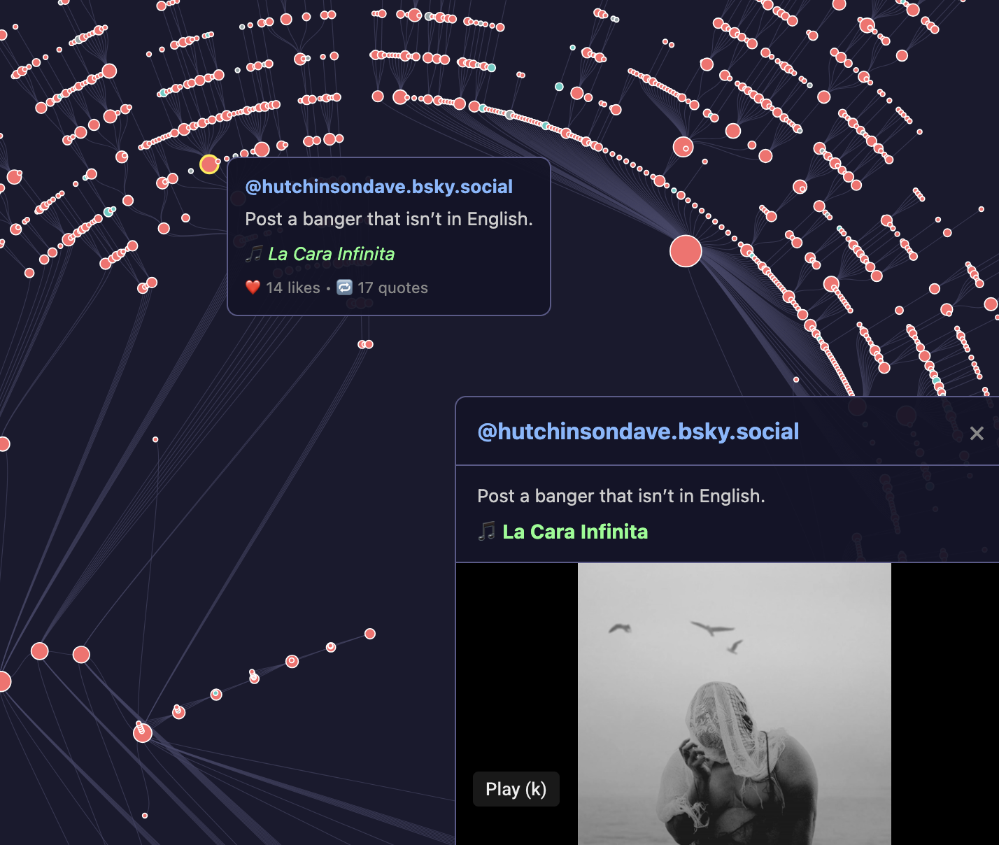

# Banger Crawler 🎵

A tool to crawl and visualize the Bluesky meme **"Post a banger that isn't in English"** - a viral chain of quote-posts

## The Meme

Started on March 24, 2024 by [@bridgemusicbunker.bsky.social](https://bsky.app/profile/bridgemusicbunker.bsky.social) with... Scatman John's "Scatman".

The meme spread through quote-posts, creating a massive tree structure that's now **25 levels deep** with **2,300+ posts**.

## Live Visualization



👉 **[View the interactive tree](https://llimllib.github.io/banger_crawler/)**

- **Scroll** to zoom in/out
- **Drag** to pan
- **Hover** on nodes to see post details
- **Click** a node to play the song (YouTube, Spotify, Apple Music embeds)

Node colors:

- 🔴 Red = YouTube video
- 🔵 Teal = Other media (Spotify, Apple Music, etc.)
- ⚫ Gray = No media attached

Node size = number of quote-posts

## Top Songs

| #   | Song                                                                                         | Posts |
| --- | -------------------------------------------------------------------------------------------- | ----- |
| 1   | [Adriano Celentano - Prisencolinensinainciusol](https://www.youtube.com/watch?v=fU-wH8SrFro) | 48    |
| 2   | [Plastic Bertrand - Ça Plane Pour Moi](https://www.youtube.com/watch?v=Ln31raI2ezY)          | 24    |
| 3   | [Nena - 99 Luftballons](https://www.youtube.com/watch?v=Fpu5a0Bl8eY)                         | 17    |
| 4   | [La Bamba](https://www.youtube.com/watch?v=BycLmWI97Nc)                                      | 12    |
| 5   | [O-Zone - Dragostea Din Tei](https://www.youtube.com/watch?v=YnopHCL1Jk8)                    | 11    |
| 6   | [The HU - Wolf Totem](https://www.youtube.com/watch?v=jM8dCGIm6yc)                           | 9     |
| 7   | [Rammstein - Du Hast](https://www.youtube.com/watch?v=W3q8Od5qJio)                           | 8     |
| 8   | [Falco - Der Kommissar](https://www.youtube.com/watch?v=8-bgiiTxhzM)                         | 8     |
| 9   | [The HU - Yuve Yuve Yu](https://www.youtube.com/watch?v=v4xZUr0BEfE)                         | 7     |
| 10  | [Stromae - Papaoutai](https://www.youtube.com/watch?v=oiKj0Z_Xnjc)                           | 7     |

## Usage

### Crawling

Set up authentication:

```bash
export BSKY_HANDLE="your-handle.bsky.social"
export BSKY_APP_PASSWORD="xxxx-xxxx-xxxx-xxxx"
```

Trace from a post back to the root:

```bash
python banger_crawler.py trace "https://bsky.app/profile/someone/post/abc123"
```

Crawl all quotes from a post:

```bash
python banger_crawler.py crawl "at://did:plc:xxx/app.bsky.feed.post/abc123"
```

Crawl all uncrawled quotes in the database:

```bash
python banger_crawler.py crawl-all
```

Update the tree (efficiently check for new quotes on existing posts):

```bash
python banger_crawler.py update
```

View stats:

```bash
python banger_crawler.py stats
```

### Exporting

Generate the tree JSON and song stats:

```bash
python export_tree.py
```

### Viewing locally

```bash
python -m http.server 8765
# Open http://localhost:8765/tree_viz.html
```

## Files

- `banger_crawler.py` - Main crawler script
- `export_tree.py` - Export tree structure and song stats to JSON
- `tree_viz.html` - Interactive D3.js visualization
- `bangers.duckdb` - DuckDB database with all posts
- `banger_tree.json` - Tree structure for visualization
- `song_stats.json` - Top 100 songs with stats

## Requirements

- Python 3.8+
- `duckdb`
- `requests`

```bash
pip install duckdb requests
```

## License

MIT
